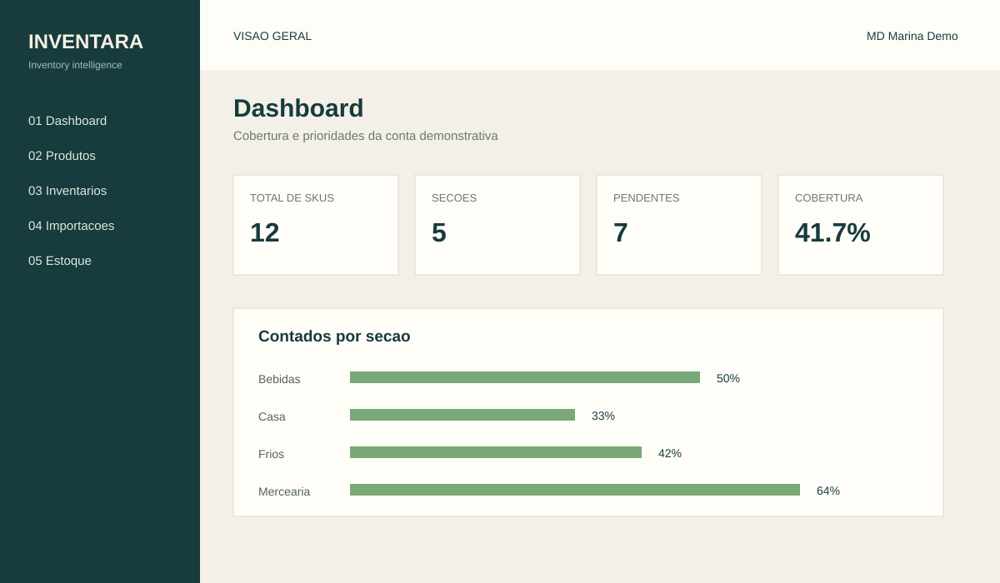
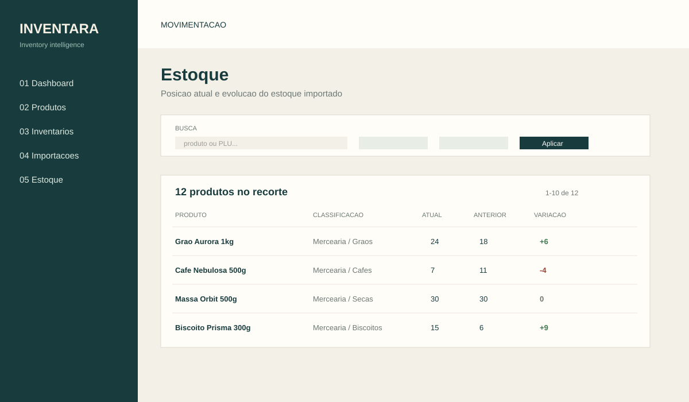

# Inventara


Sistema web para acompanhar inventários, estoque e prioridades de contagem em
operações que importam sua base de produtos por CSV.

O projeto nasceu da observação de um problema operacional: uma planilha mostra
o estoque, mas não ajuda a decidir quais grupos devem ser contados primeiro.
O Inventara transforma essa base em uma visão navegável de cobertura,
pendências, evolução do estoque e histórico de importações.

## Demonstração

A aplicação possui uma organização sintética chamada **Inventara Demo**:

```text
E-mail: demo@inventara.test
Senha: valor definido em DEMO_USER_PASSWORD
```

Os dados demo são criados pelo seed e não dependem de dados de empresas reais.
Consulte [docs/demo-account.md](docs/demo-account.md) para provisionar ou
atualizar a conta.

### Previews seguras

As imagens abaixo são previews estáticas geradas com dados fictícios. Elas não
foram capturadas do banco de produção.





## O problema

Inventários recorrentes costumam começar em relatórios exportados do ERP. Sem
uma camada de análise, a equipe precisa procurar manualmente por:

- produtos que nunca foram contados;
- grupos com baixa cobertura no ciclo atual;
- estoque que mudou desde o inventário anterior;
- arquivos já importados ou com erros de validação.

O objetivo do MVP é reduzir esse trabalho sem substituir o ERP: o ERP continua
sendo a origem dos dados, e o Inventara organiza a decisão operacional.

## Funcionalidades

- Dashboard com SKUs, cobertura, pendências, seções e prioridades.
- Inventários agrupados por seção, grupo e subgrupo.
- Fórmula de prioridade com pontuação de 0 a 100.
- Importação de CSV com aliases de cabeçalho, UTF-8/Windows-1252 e datas BR/ISO.
- Limites de tamanho e quantidade de linhas, validação e detecção de duplicados.
- Histórico de importações com contadores de inserções, atualizações e erros.
- Produtos com busca, filtros, paginação e detalhe individual.
- Estoque atual, estoque anterior, variação e histórico por produto.
- Conta demonstrativa isolada com dados sintéticos.
- Notificações para prioridades urgentes e metas de cobertura abaixo do esperado.
- Convites de equipe, matriz RBAC e auditoria de alterações de acesso.
- Limpeza segura do catálogo para substituir a base de uma organização.
- Autenticação por e-mail e senha com sessões persistidas.
- Administração de organizações e usuários com papéis `platform_admin`, `owner` e `member`.
- Isolamento por organização em páginas, APIs, produtos, importações e histórico.

## Rotas

| Rota | Função |
| --- | --- |
| `/` | Dashboard e indicadores do ciclo atual |
| `/produtos` | Busca, filtros e paginação de produtos |
| `/produtos/[plu]` | Detalhe e histórico de estoque do produto |
| `/inventarios` | Prioridade de contagem por subgrupo |
| `/importacoes` | Histórico dos arquivos importados |
| `/estoque` | Posição atual e evolução do estoque |
| `/notificacoes` | Alertas ativos e notificações da organização |
| `/configuracoes` | Informações da organização e da sessão |
| `/configuracoes/usuarios` | Gestão de usuários da organização pelo owner |
| `/configuracoes/permissoes` | Matriz de permissões por perfil |
| `/configuracoes/auditoria` | Auditoria de acessos e convites |
| `/convites/[token]` | Aceite de convite de equipe |
| `/admin/organizacoes` | Criação de organizações pelo platform admin |
| `/login` | Autenticação |
| `/api/importacoes` | Upload protegido de CSV |

## Arquitetura

```text
Browser
  -> Next.js App Router
     -> Proxy de autenticação
     -> Server Components e Route Handlers
        -> Camada de dados / Prisma Client
           -> PostgreSQL local ou Neon
```

As páginas server-rendered consultam o banco depois de validar a sessão. O
identificador da organização vem do usuário autenticado, não de um parâmetro
fornecido pelo navegador.

## Stack

| Camada | Tecnologia |
| --- | --- |
| Aplicação | Next.js 16, React 19, TypeScript |
| Interface | CSS próprio, Server Components, Suspense |
| Autenticação | Better Auth com adapter Prisma |
| Persistência | PostgreSQL |
| ORM | Prisma 7 com `@prisma/adapter-pg` |
| CSV | Papa Parse |
| Desenvolvimento | Docker Compose |
| Produção | Vercel + Neon |
| CI | GitHub Actions |

## Banco de dados

O schema contém as seguintes entidades principais:

- `Organization`: tenant da aplicação.
- `User`: usuário, papel, status de acesso e vínculo opcional com uma organização.
- `Account` e `Session`: credenciais e sessões do Better Auth.
- `Product`: catálogo e estoque atual.
- `ImportRecord`: execução de cada importação.
- `StockHistory`: snapshot do estoque por produto e importação.
- `Notification` e `NotificationRead`: alertas deduplicados e leituras por usuário.

O histórico é append-only por importação. Isso permite comparar os dois últimos
snapshots sem substituir a evidência de uma importação anterior.

## Importação CSV

O arquivo deve conter estes campos, aceitando os aliases implementados no
parser:

```text
Descrição;Código PLU;Código Barras;Descrição Seção;Descrição Grupo;Descrição SubGrupo;Data Últ. Inventário;Estoque Atual
Produto sintético;DEMO-9001;7900000009001;Mercearia;Exemplo;Teste;26/08/2026;12,500
```

O parser identifica automaticamente delimitador, remove BOM, tenta UTF-8 e
Windows-1252, aceita datas `DD/MM/YYYY` ou `YYYY-MM-DD` e converte estoque
decimal brasileiro. O endpoint limita o arquivo a 5 MB e 50.000 registros.

Cada importação é executada em uma transação. Se uma etapa falhar, o catálogo,
o registro da importação e os snapshots não ficam parcialmente gravados.

## Prioridade de inventários

Cada subgrupo recebe uma pontuação baseada em:

| Fator | Peso |
| --- | ---: |
| Quantidade pendente | 35 |
| Percentual pendente | 25 |
| Antiguidade | 20 |
| Itens sem data | 10 |
| Volume do subgrupo | 10 |

As partes de volume usam escala logarítmica para evitar que grupos grandes
dominem automaticamente todos os outros. As faixas são `Urgente` (70+),
`Alta` (50–69,9), `Média` (30–49,9), `Baixa` (abaixo de 30) e `Atualizado`
quando não há pendências. A especificação completa está em
[docs/inventory-priority.md](docs/inventory-priority.md).

## Multi-tenancy e segurança

- Todas as consultas recebem `organizationId` derivado da sessão.
- O proxy protege páginas e APIs sem sessão.
- O cadastro público está desabilitado.
- Senhas são armazenadas somente como hashes gerados pelo Better Auth.
- Uploads têm limites de tamanho, linhas, extensão e duplicidade.
- Hash SHA-256 identifica arquivos repetidos no período de proteção.
- Segredos ficam em variáveis de ambiente e são ignorados pelo Git.
- A conta demo usa organização, produtos e snapshots próprios.
- A limpeza do catálogo exige a confirmação literal `APAGAR TUDO` e remove
  apenas produtos, importações e snapshots do tenant autenticado.

Detalhes do fluxo de autenticação estão em
[docs/authentication.md](docs/authentication.md).

## Instalação local

Pré-requisitos: Node.js 24 ou superior, npm e Docker com Compose.

```bash
git clone https://github.com/joaovitorfirme123/inventara.git
cd inventara
cp .env.example .env
npm ci
docker compose up -d
npm run db:deploy
npm run db:seed
npm run dev
```

Abra [http://localhost:3000](http://localhost:3000). O seed cria as contas
Alfa, Beta e Demo. Defina `SEED_USER_PASSWORD` e, opcionalmente,
`DEMO_USER_PASSWORD` no `.env` antes de executá-lo.

Para parar o PostgreSQL local:

```bash
docker compose down
```

## Variáveis de ambiente

| Variável | Uso |
| --- | --- |
| `DATABASE_URL` | Connection string do PostgreSQL para o runtime |
| `DIRECT_URL` | Connection string direct para migrations de produção |
| `BETTER_AUTH_SECRET` | Segredo da autenticação, mínimo de 32 caracteres |
| `BETTER_AUTH_URL` | URL base da aplicação |
| `SEED_USER_PASSWORD` | Senha das contas locais Alfa/Beta |
| `DEMO_USER_PASSWORD` | Senha opcional da conta sintética Demo |

Nunca versione `.env` ou coloque credenciais em variáveis `NEXT_PUBLIC_*`.

Para criar o administrador global em um ambiente controlado, use o comando
`npm run db:bootstrap-admin` com `PLATFORM_ADMIN_EMAIL`,
`PLATFORM_ADMIN_NAME` e `PLATFORM_ADMIN_PASSWORD` definidos apenas no terminal.

## Testes e qualidade

Lint e build:

```bash
npm run lint
npm run build
```

Migrations e banco:

```bash
npm run db:status
npm run db:deploy
npm run db:check
```

Testes de dados:

```bash
npm run test:tenancy
npm run test:products
npm run test:csv
npm run test:history
npm run test:inventories
npm run test:dashboard
npm run test:stock
npm run test:stock-page
npm run test:demo
npm run test:product-details
```

Com o servidor de produção local ativo, execute também:

```bash
npm run test:authentication
npm run test:isolation
npm run test:security
```

O GitHub Actions repete migrations, seed, lint, build e os testes de dados e
HTTP em um PostgreSQL descartável.

## Deploy

O projeto está preparado para Vercel e Neon. O `vercel.json` aplica migrations
pendentes antes do build:

```text
npm run db:deploy && npm run build
```

Siga [docs/deployment.md](docs/deployment.md) para configurar o banco,
variáveis de produção e a validação pós-deploy.

## Estrutura do projeto

```text
src/app/       rotas e páginas do App Router
src/components componentes reutilizáveis da interface
src/data/      consultas e regras de acesso aos dados
src/lib/       autenticação, parser, Prisma e regras de domínio
prisma/        schema, migrations e seed
scripts/       testes de integração e verificações
docs/          decisões técnicas e procedimentos operacionais
```

## Aprendizados

- Como modelar snapshots para preservar evolução do estoque.
- Como derivar prioridades de inventário de dados imperfeitos.
- Como manter autorização por tenant na camada de dados.
- Como validar e importar arquivos reais sem persistência parcial.
- Como separar seed local, dados demo e banco de produção.
- Como preparar migrations e variáveis para uma aplicação Next.js server-rendered.

## Melhorias futuras

- Planejamento de inventários e responsáveis por contagem.
- Status operacional por inventário.
- Metas de cobertura e alertas.
- Exportação para Excel e PDF.
- Comparação entre períodos.
- Auditoria de alterações.

## Privacidade

O projeto é uma implementação genérica baseada em um problema operacional real.
O material público usa somente dados sintéticos e não identifica empresa,
relatórios internos, produtos reais ou estoques reais.

O texto resumido para apresentação está em
[docs/portfolio.md](docs/portfolio.md).

## Licença

Projeto de portfólio. Consulte o proprietário do repositório antes de reutilizar
o código ou os dados de demonstração.
